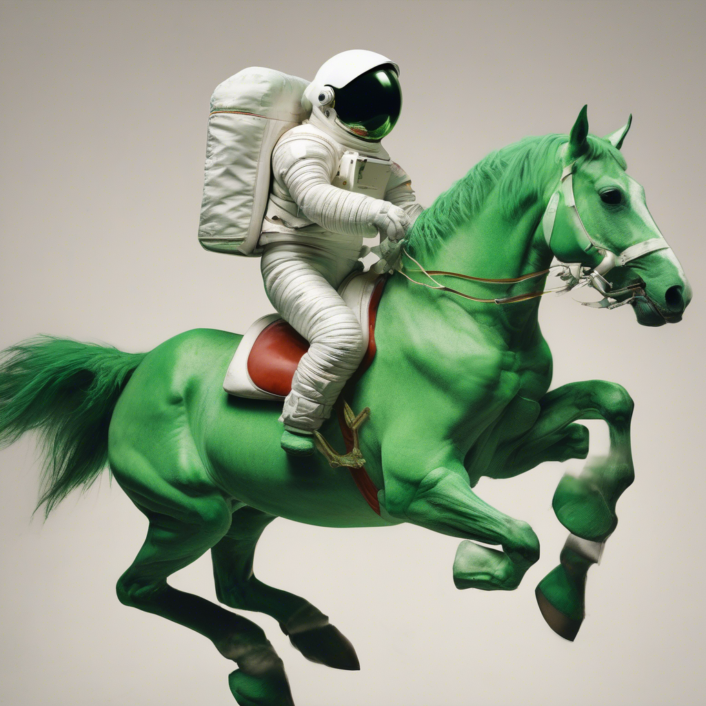
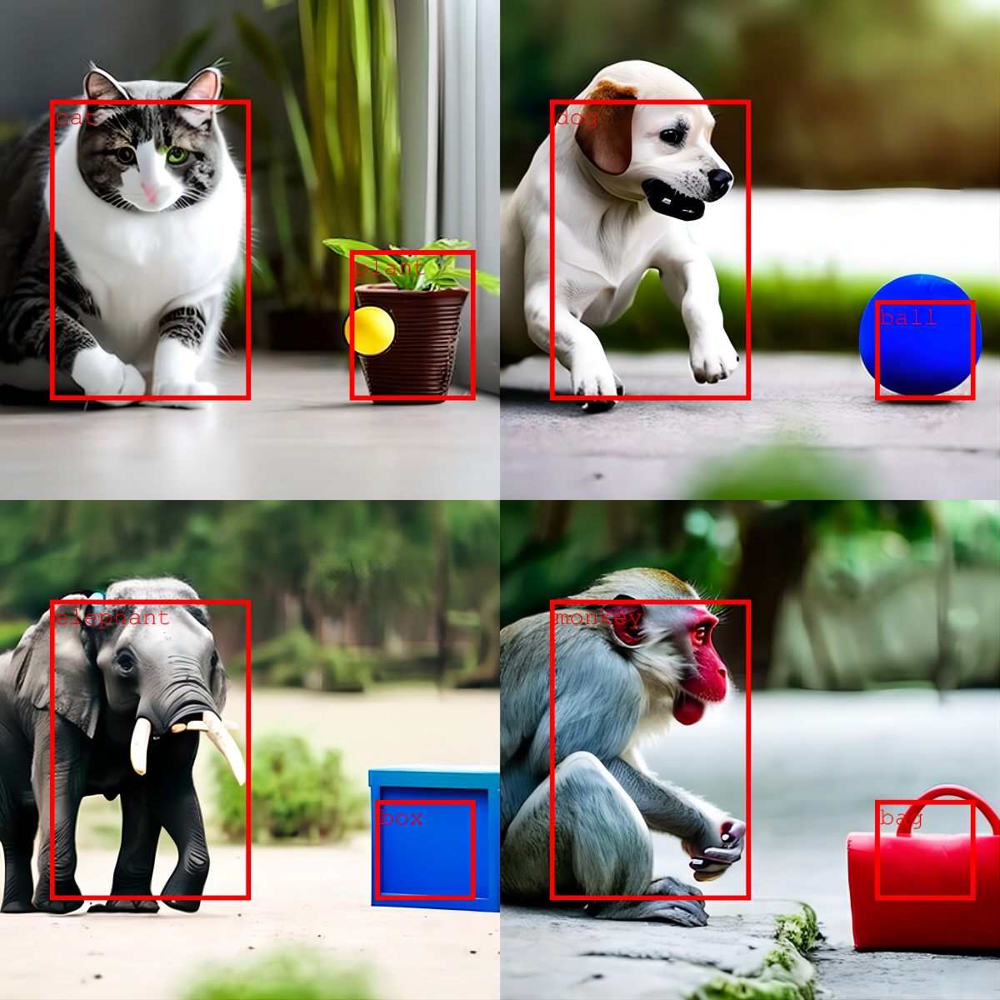

# Stable Diffusion with Layout Guidance Integration  

## 1 项目简介

本仓库依托于2024年西安交通大学课题组考核，学习AIGC相关内容，以此记录。

实现内容如下：

1. 学会使用`Diffusers`包调用`StableDiffusionXL`生成图片
2. 在`Diffusers`版本的`StableDiffusionXL`中复现`Training-Free Layout Control with Cross-Attention Guidance`论文

`layout-guidance`是在`Stable Diffusion-v1.5`的基础上做的实验，本项目将其复现到了`SD2.1`和`SDXL1.0base`，以创造更加精准、符合预期的图像生成体验。通过结合这两种技术，用户可以更细致地控制生成图像的各个方面，从全局布局到细节描绘，实现更高质量的图像创作。  

## 2 相关技术

### 2.1 Stable Diffusion


- 项目地址：https://github.com/Stability-AI/generative-models
- 模型地址：https://huggingface.co/stabilityai/stable-diffusion-xl-base-1.0

Stable Diffusion是一个基于Transformers的模型，它利用扩散模型（Diffusion Models）的原理，能够从文本描述中生成高度详细的图像。该模型在多个数据集上进行训练，能够生成多样化和逼真的图像。  


Stable Diffusion的模型架构主要包括以下几个部分：

- **文本编码器**：将输入的文本描述转换为嵌入表示，这些嵌入表示作为条件信息输入到U-Net模型中。 
- **U-Net模型**：作为噪声预测器，U-Net模型负责在每个反向扩散步骤中预测并去除添加的噪声。U-Net模型具有跳跃连接（Skip Connections），能够捕获图像中的多尺度信息，从而生成更精细的图像细节。 
- **变分自动编码器（VAE）**：VAE在Stable Diffusion中用于将图像压缩到潜在空间，并在生成过程中从潜在空间恢复图像。这有助于减少计算复杂度并提高生成速度。

### 2.2 Layout Guidance


- 项目地址：https://github.com/silent-chen/layout-guidance
- Demo地址：https://huggingface.co/spaces/silentchen/layout-guidance

布局指导技术通过预定义或用户指定的图像布局（如对象的位置、大小、关系等），引导图像生成过程，从而确保生成的图像符合预期的构图和视觉层次。

为了`forward-guidance`解决的缺点，引入了一种替代机制，称之为`backward-guidance`。不是直接操纵注意力图，而是通过引入能量函数来偏置注意力：
$$
E\left(A^{(\gamma)}, B, i\right)=\left(1-\frac{\sum_{u \in B} A_{u i}^{(\gamma)}}{\sum_{u} A_{u i}^{(\gamma)}}\right)^{2}
$$
优化该函数鼓励第$i$个标记的交叉注意力图获得$B$指定的区域内的更高值。具体来说，在降噪器$D$的每个应用中，当评估层$  γ ∈ Γ  $时，上述公式的损失的梯度通过反向传播计算以更新潜在$z_{t}\left(\equiv z_{t}^{(0)}\right)$：

$$
z_{t} \leftarrow z_{t}-\sigma_{t}^{2} \eta \nabla_{z_{t}} \sum_{\gamma \in \Gamma} E\left(A^{(\gamma)}, B, i\right)
$$

其中$  η > 0  $是控制引导强度的比例因子，$\sigma_{t}=\sqrt{\left(1-\alpha_{t}\right) / \alpha_{t}}$。通过更新潜在的，所有标记的交叉注意力图受到后向指导的间接影响。为了生成图像，在梯度更新和去噪步骤之间交替。

## 3 实现

### 3.1 实现思路

任务1：见`task1.jpynb`。

任务2：需要把`SD`推理过程中的注意力图给提取出来，然后计算`loss`，并对`latent`求梯度进行更新，因此需要修改原始的`pipeline`中的各个注意力计算部分，
最终将注意力矩阵作为返回值进行返回。

### 3.2 代码运行

本项目在8卡NVIDIA GeForce RTX 3090、显存234GB的服务器上进行测试。

- 在`Stable-Diffusion-v1.5`基础上进行布局控制
```bash
python inference.py general.type=sd1.5
```

- 在`Stable-Diffusion-v2.1`基础上进行布局控制
```bash
python inference.py general.type=sd2.1
```

- 在`Stable-DiffusionXL-base-1.0`基础上进行布局控制，在24GB的显存上会OOM，应当使用具有更大内存的显卡
```bash
python inference.py general.type=sdxl
```

### 3.3 运行结果

#### 任务1

- promte：An astronaut riding a green hors



#### 任务2

- Stable-Diffusion-v2.1


